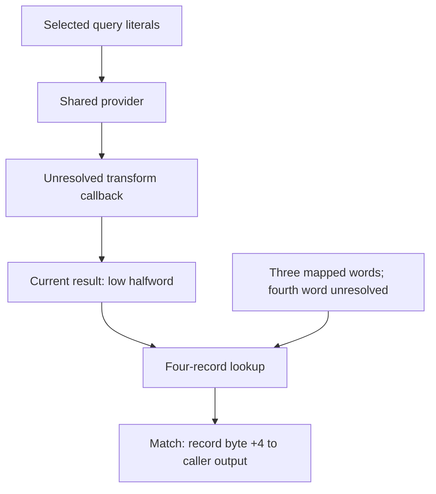

# PC/USB transition policy and query provider

[Map](../FIRMWARE_MAP.md) · [Reading conventions](READING.md) · [Open questions](../RESEARCH.md)

The reviewed source connects an internal transition policy to conditional
queries and a dynamic provider list. Physical USB input, relevant runtime
values, and shooting effects remain unresolved. The separate communication
state family is described in [USB lifecycle](USB_LIFECYCLE.md).

- [PC/USB state-transition policy and callers](#pc-usb-transition)
  - [Transition rules](#transition-rules)
  - [Singleton and selected query slots](#singleton-and-selected-query-slots)
  - [Provider and list source anchors](#provider-and-list-source-anchors)
  - [Construction and wrapper contracts](#construction-and-wrapper-contracts)
  - [Query transformation and record lookup](#query-transformation-and-record-lookup)
  - [Dynamic list production and the fourth word](#dynamic-list-production-and-the-fourth-word)
  - [State records and event dispatch](#state-records-and-event-dispatch)
  - [Remaining connection to physical USB behavior](#remaining-connection-to-physical-usb-behavior)

## PC/USB state-transition policy and callers

A range-only state family connects a 23-by-23 transition matrix, diagnostic
state names, record construction, and several PC/USB-labelled bodies. It
establishes an internal transition policy and bounded direct-caller edges, but
does not establish that a physical USB event selects them or that an accepted
transition changes the active interface or shooting availability.

| Role | Local address / placement | Block | Offset | Length |
|---|---:|---:|---|---:|
| Diagnostic state mapper | `0x6efcbd07` | 0 | `0x009cbd27` | 392 |
| Eight PC/USB-labelled bodies | `0x6efd3e99` | 0 | `0x009d3eb9` | 546 |
| Separate state-21 caller | `0x6efd41b0` | 0 | `0x009d41d0` | 71 |
| Disconnect-labelled conditional caller | `0x6efd4245` | 0 | `0x009d4265` | 90 |
| 23-by-23 transition matrix | DATA-local `0x6f10fd84` | 0 | `0x00b0e964` | 529 |
| State-name sequence | DATA-local `0x6f11004c` | 0 | `0x00b0ec2c` | 611 |

The four code spans use the conditional CODE-local view
`source + 0x6e5fffe0`; the matrix and names use the separate conditional
DATA-local view `source + 0x6e601420`. These are authenticated range anchors,
not canonical instruction rows. Contextual GNU MN103 decoding with source
lookahead supports the relationships below, but neither address arithmetic nor
the labels establish runtime placement or physical USB meaning.

### Transition rules

The neighboring request owner preserves its proposed state in `d3` and its
receiver in `a2` across a validator call whose encoded mask includes both
registers. Only current validator result 1 selects the record mapper and the
store of the proposed state to `0x6034cf84`; the owner itself is contextual
source, not one of the canonical ranges above. The validator treats the
matrix row as proposed state minus one and the column as current state minus
one. Matrix values 0 reject, 1 are ordinary candidates, 2 conditionally call
virtual slot `+40`, and 3 conditionally call virtual slot `+48`; those calls'
zero-result tests make values 2 and 3 conditional rather than unconditional
transition effects.

The selected matrix cells for states 11, 17, 18, 19, 20, and 21 are:

| Proposed \ current | 11 | 17 | 18 | 19 | 20 | 21 |
|---:|---:|---:|---:|---:|---:|---:|
| 11 | 1 | 3 | 2 | 2 | 2 | 2 |
| 17 | 0 | 1 | 2 | 2 | 2 | 2 |
| 18 | 0 | 0 | 1 | 1 | 1 | 1 |
| 19 | 0 | 0 | 1 | 1 | 1 | 1 |
| 20 | 0 | 0 | 1 | 1 | 1 | 1 |
| 21 | 0 | 0 | 1 | 1 | 1 | 1 |

### Singleton and selected query slots

The conditional checks use one lazy singleton and one installed table. This
source-level object join resolves the validator's exact slot targets and
returned Boolean-shaped values. The shared lower-provider path continues
through a dynamic four-record list, but stops at unresolved callback and list
value provenance.

| Role | Conditional local view | Block | Offset | Length |
|---|---:|---:|---|---:|
| Common lower-provider body | CODE `0x6e872e39` | 0 | `0x00272e59` | 59 |
| Lazy singleton accessor | CODE `0x6eb80ed7` | 0 | `0x00580ef7` | 88 |
| Slot-`+48` wrapper | CODE `0x6eb81062` | 0 | `0x00581082` | 92 |
| Slot-`+40` wrapper | CODE `0x6eb81181` | 0 | `0x005811a1` | 92 |
| Constructor | CODE `0x6eb812f5` | 0 | `0x00581315` | 30 |
| Object-field-`+4` setter | CODE `0x6eb81ce0` | 0 | `0x00581d00` | 3 |
| Slot-`+48` lower predicate | CODE `0x6eba143f` | 0 | `0x005a145f` | 31 |
| Slot-`+40` lower predicate | CODE `0x6eba19d3` | 0 | `0x005a19f3` | 48 |
| Constructor helper caller | CODE `0x6eba2153` | 0 | `0x005a2173` | 13 |
| Receiver-preserving helper body | CODE `0x6eba22d1` | 0 | `0x005a22f1` | 95 |
| Receiver-adjustment leaf | CODE `0x6eba2333` | 0 | `0x005a2353` | 3 |
| Lower-predicate entry leaf | CODE `0x6ec09287` | 0 | `0x006092a7` | 3 |
| Lower-predicate exit leaf | CODE `0x6ec0928a` | 0 | `0x006092aa` | 3 |
| Slot-`+48` normalized query | CODE `0x6ec09347` | 0 | `0x00609367` | 24 |
| Slot-`+40` normalized query | CODE `0x6ec093ef` | 0 | `0x0060940f` | 24 |
| Installed object table | DATA `0x6ee3eb40` | 0 | `0x0083d720` | 56 |
| Value-3 failure label | DATA `0x6f10ffdc` | 0 | `0x00b0ebbc` | 23 |
| Value-2 failure label | DATA `0x6f11000e` | 0 | `0x00b0ebee` | 26 |

### Provider and list source anchors

The provider-side ranges use the conditional CODE-local view
`source + 0x6e5fffe0`:

| Role | Conditional local view | Block | Offset | Length |
|---|---:|---:|---|---:|
| Provider orchestration slice | `0x6e85eace` | 0 | `0x0025eaee` | 425 |
| Four-record list feed | `0x6e85f534` | 0 | `0x0025f554` | 35 |
| Four-record list clearer | `0x6e85f557` | 0 | `0x0025f577` | 32 |
| Callback and enable helpers | `0x6e85f577` | 0 | `0x0025f597` | 125 |
| Record-status writer | `0x6e85f5f4` | 0 | `0x0025f614` | 303 |
| Selected-query provider | `0x6e85f723` | 0 | `0x0025f743` | 67 |
| Dynamic list owner | `0x6ebb3d64` | 0 | `0x005b3d84` | 412 |
| Finite list-value mapper | `0x6ebb47f6` | 0 | `0x005b4816` | 31 |

### Construction and wrapper contracts

The accessor reads global `0x60357abc`, takes a bounded allocation and
construction path when it is null, stores the constructed result back to that
global, and returns the final loaded object. The constructor installs table
pointer `0x6ee3eb40` at object `+0`, clears object `+4`, and passes a helper
result to the complete setter at source `0x00581d00`. The selected helper body
returns with `a2` preserved, and its other direct leaf changes only `a0`, so the
constructor's saved receiver survives this bounded path. Allocation success,
runtime table placement, replacement, lifetime, and synchronization are not
established.

Under the conditional DATA-local view `source + 0x6e601420`, table word
`+40` at source `0x0083d748` nominates source `0x005811a1`, while word `+48`
at `0x0083d750` nominates `0x00581082`. Each wrapper saves its receiver,
loads object field `+4`, calls its selected lower predicate, preserves the
predicate result in `d2` through the bounded reporting path, copies it back to
`d0`, and returns. The slot-`+40` lower path calls source `0x0060940f`; the
slot-`+48` path calls `0x00609367`. Both queries normalize the common
provider's result to 0 or 1. The `+40` fallback at source `0x00609483` clears
`d0` but leaves the saved `d2` result unchanged.

### Query transformation and record lookup

This diagram summarizes the reviewed local relationships under the address
views above. The callback target, dynamic values, and runtime placement remain
unresolved; this is not a physical USB-event route.

The two queries pass exact literals `0x02020400` (`+40`) and `0x02020501`
(`+48`) to source `0x00272e59`, whose call at `0x00272e62` reaches the
selected-query provider. That provider passes the query word through the
conditional callback pointer at `0x605fd84c`, masks the current result to its
low halfword, and scans eight-byte records rooted at `0x605fd820`. A matching
record copies byte `+4` to the caller's output halfword; a miss leaves that
output unchanged. The callback target and its result are unresolved, so the
pre-callback low halfwords `0x0400` and `0x0501` do not establish the compared
keys.

### Dynamic list production and the fourth word

The dynamic owner clears four records, conditionally maps its current `d2`,
`d3`, and `a2` values through source `0x005b4816`, writes the three results to
`0x60358ce8`, `0x60358cec`, and `0x60358cf0`, and feeds the list to the
four-record copier. The complete mapper returns `0x0000000b` for input 15,
`0x0000120a` for input 16, `0x00001209` for input 11, and zero for every other
input. It changes only `d0` and `d1`, so the three sequential current inputs
survive its calls. The preceding list-clear call has no encoded preservation
mask, however, so those current values are not proved natural-entry inputs and
which slots become nonzero remains dynamic.

The owner reads a fourth word at `0x60358cf4`, but this bounded span establishes
no writer, initialization, or deliberately-zero lifetime for it. The copier
can therefore consume an unknown fourth word when the first three are nonzero.
The explicit slots' exact possible nonzero values are bounded to
`{0x0000000b, 0x00001209, 0x0000120a}`; neither selected query's post-callback
key is proved to be a member of that set.

The record-status body updates bytes `+4` and `+5` only for query high-word
cases `0x0200` and `0x0201`. The selected queries have high word `0x0202`, so
this body does not source-prove their record byte `+4` values. The callback
helpers install, clear, and conditionally invoke pointers; they are not
standalone pointer getters. The two failure-label ranges identify validator
branches only; they do not assign connected/disconnected meaning to the table
slots, list keys, record bytes, or returned values.

In the complete contextual validator, matrix value 3 calls slot `+48` and
accepts result 0, while value 2 calls slot `+40` and also accepts result 0.
Later state 17 calls `+48` and requires result 1; states 18 through 23 call
`+40` and require result 1. The wrappers do not invert their lower results;
the required polarity depends on validator context. The full validator is
contextual support rather than a new canonical range because its tail overlaps
the existing source range beginning at `0x009cbc27`.

### State records and event dispatch

The state-name sequence labels 11 `CAM_SHOOTING`, 17
`PC_START_PC_USB_SELECT`, 19 `PC_START_PC_WAIT_USB_DISCONNECT`, 20
`PC_RETURN`, and 21 `PC_CAM_SHOOTING`. The record mapper associates state 19
with fields `+4=243` and `+20=277`. These labels and numeric fields describe
the internal records; they do not prove a USB event, state lifetime, or effect.

The eight-body span contains bodies associated by nearby name pointers with
USB selection, PC mode, PC start/print, waiting for USB disconnect, and ending
USB selection. Their selected paths prepare fields or call local helpers; none
of the bodies directly calls the transition owner or contains an established
interface teardown, session close, MTP start, or automatic re-enumeration.

The disconnect-labelled body requests only states 11, 17, 15, or 6 under its
current mode and helper results, then calls the transition owner. It never
requests state 20. The separate caller maps receiver field `+0` values 178 or
179 to state 22, 180 to state 23, and 181 to state 21 before its direct owner
call. No accepted source binds either receiver to a physical disconnect input.

An adjacent range-only event family adds a conditional path into the interior
of the disconnect-labelled body, plus exact owners for two internal globals:

| Role | Local address | Block | Offset | Length |
|---|---:|---:|---|---:|
| Flag clear/get/set leaves | `0x6efc9054` | 0 | `0x009c9074` | 36 |
| Selected flag-setter caller | `0x6efc912f` | 0 | `0x009c914f` | 25 |
| Event-field dispatcher | `0x6efd39ce` | 0 | `0x009d39ee` | 218 |
| Mode-state mapper | `0x6efd3ab3` | 0 | `0x009d3ad3` | 92 |
| Mode-state store leaf | `0x6efd3b0f` | 0 | `0x009d3b2f` | 9 |
| Mode-state load leaf | `0x6efd3b18` | 0 | `0x009d3b38` | 9 |

These spans use the same conditional CODE-local view and add no canonical
instruction rows. The flag leaves clear `0x6066a53c` and `0x6066a540`, read
`0x6066a53c`, or write literal 1 to `0x6066a53c`. The selected setter caller
passes entry `a1` through saved `a2`, calls the setter, then writes 306 at
receiver `+76` and 1 at receiver `+84`. The flag's physical meaning, clearer
input, lifetime, and relationship to the transition receiver remain unresolved.

The dispatcher initially copies entry `a1` to `a3`, but two later direct calls
with empty encoded preservation masks intervene before current `a3` is used.
It then reads current field `a3+4` and clears that same current field. This
establishes field direction for the current object, not preservation of the
entry receiver. The read value maps as follows: 240 calls the mode-state
mapper; 241 maps to 1; 242 to 2; 243 to 3; 244 to 4; 245 to 6; and unmatched
values to 1. Each fixed arm calls the exact store leaf for `0x6066a670`.

The mode-state mapper can write 0, 1, 2, 3, or 4 to `0x6066a670` under its
current helper results, and the exact load leaf returns the current global.
These numeric producers are internally established but have no source-proved
USB, interface, or shooting meaning.

The dispatcher's interior call into the disconnect-labelled body occurs only
when a separate virtual-slot-`+40` call returns current value 1. Event 243
instead skips a later helper/indirect-call pair; that value alone does not
select the interior call. Although the state-19 record mapper writes `+4=243`,
no accepted writer-to-dispatcher edge or common object identity joins that
record to the current dispatch object.

### Remaining connection to physical USB behavior

The first missing joins are the dynamic transform callback and fourth-word
provenance behind the selected-query provider, plus a source-authenticated
physical USB or interface-release owner of the dispatcher's incoming event
object. They require receiver preservation through the intervening calls and
an accepted `PC_RETURN` or `PC_CAM_SHOOTING` transition. Active-interface
teardown, ordinary shooting, MTP re-entry, capture, image production, and host
transfer remain unproved.

**Next evidence:** [Policy provider inputs](../RESEARCH.md#r-usb-policy-provider)
and [physical event ownership](../RESEARCH.md#r-usb-event-owner).
